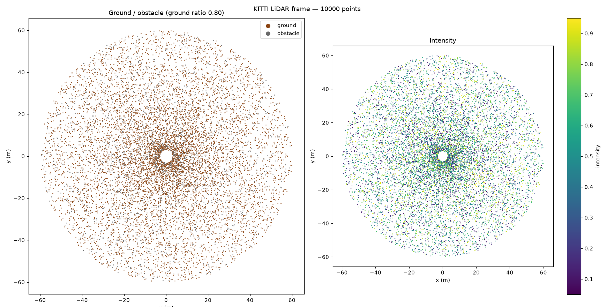

# HD Map Pipeline

**A C++20 pipeline for HD-map and sensor-data engineering — GPS/IMU trajectory
analysis, true WGS84 ENU georeferencing, road-network graph construction from
OpenStreetMap, HMM/Viterbi map matching, LiDAR point-cloud integrity validation,
spatial indexing, and reproducible benchmarking.**

It ingests raw self-driving sensor logs (KITTI OXTS GPS/IMU + Velodyne LiDAR),
georeferences the GPS trajectory into a true WGS84 ENU frame, matches it onto an
OpenStreetMap road-network graph, indexes and validates 3D point clouds, and
measures every stage with a benchmark harness, a GoogleTest suite, continuous
integration, and Python visualization.

**What has actually been run (real data, on EC2):**
- The **KITTI-GPS → real-OSM map-matching workflow** was executed on the real
  `2011_09_26_drive_0001_sync` OXTS trajectory (108 GPS observations) against a
  real Karlsruhe OpenStreetMap extract, building a 14,297-node / 15,087-edge road
  graph and matching all 108 observations (see
  [Real KITTI → OSM workflow](#real-kitti--osm-workflow)).
- The **LiDAR ingestion and integrity benchmarks** were executed on the same real
  sequence's 108 Velodyne frames (see [Results](#results-real-kitti)).

Synthetic/fixture benchmarks are labeled as such and are never mixed with the
real-data numbers.

> **Keywords:** HD maps · autonomous driving · SLAM-adjacent mapping · KITTI raw
> dataset · OXTS GPS/IMU · Velodyne LiDAR · point cloud · WGS84 · ECEF · ENU ·
> road-network graph · OpenStreetMap · centerline extraction · map matching ·
> Hidden Markov Model · Viterbi · Newson–Krumm · Schroedl / Biagioni · RANSAC
> ground segmentation · nanoflann · k-d tree · nearest-neighbour search · CRC32 ·
> data integrity · Dijkstra · C++20 · CMake · Google Benchmark · GoogleTest ·
> GitHub Actions CI · AddressSanitizer · UBSan · GDB · folium · matplotlib.

---

## Table of contents

- [Why this matters (impact)](#why-this-matters-impact)
- [What it does](#what-it-does)
- [Technology stack](#technology-stack)
- [Architecture](#architecture)
- [Components in detail](#components-in-detail)
- [Algorithms & math](#algorithms--math)
- [Data formats](#data-formats)
- [Building](#building)
- [Running](#running)
- [Results (real KITTI)](#results-real-kitti)
- [Testing, sanitizers & CI](#testing-sanitizers--ci)
- [Engineering war stories — every bug and how it was solved](#engineering-war-stories--every-bug-and-how-it-was-solved)
- [Where it was built and run](#where-it-was-built-and-run)
- [Repository layout](#repository-layout)
- [Roadmap](#roadmap)
- [License & attribution](#license--attribution)

---

## Why this matters (impact)

HD (high-definition) maps are the backbone of autonomous driving: a self-driving
stack needs centimetre-accurate road geometry, a routable road-network graph, and
absolute trust in the sensor data those maps are built from. This project builds
the ingestion-to-map core of that workflow and the quality gates around it:

- **Turning raw drives into maps.** GPS/IMU traces become road centerlines and a
  routable graph; trajectories are snapped onto that graph with confidence
  scores. This is the "trajectory data mining" that HD-map teams do at fleet
  scale.
- **Trusting the sensors.** Every LiDAR frame is CRC-checked and run through an
  eight-point integrity validator (point count, NaN/Inf, range, angular coverage,
  intensity distribution, ground-plane sanity) — because a map built on corrupt
  frames is worse than no map.
- **Doing it fast and provably.** Ingestion, graph construction, spatial queries,
  and validation are all benchmarked with real numbers on the real KITTI dataset,
  not estimates — so performance regressions are visible, not hidden.

The capabilities line up directly with the work of HD-mapping / sensor-fusion
teams (e.g. NVIDIA DeepMap–style road-network extraction, sensor-data validation,
and 2D/3D map benchmarking).

---

## What it does

Three distinct concepts are kept separate throughout — they are **not** the same
thing:

- **GPS trajectory clustering** builds a *trajectory-derived candidate centerline
  graph* from the GPS trace alone (Schroedl / Biagioni). It does **not** produce a
  road network from a map.
- **OpenStreetMap import** builds an *attributed OSM road graph* from an `.osm`
  extract (length, speed, class, polyline).
- **HMM / Viterbi map matching** *matches GPS observations onto the existing OSM
  road graph*. It does **not** extract or infer the road network from GPS.

| Capability | Implementation |
|---|---|
| GPS/IMU trajectory analysis | KITTI OXTS reader → **true WGS84 ENU** (geodetic → ECEF → ENU), IMU + accuracy fields |
| Trajectory-derived centerline graph | Trace-clustering (Schroedl / Biagioni) on GPS heading + spatial proximity |
| OSM road-graph construction | OSM `.osm` → attributed graph (length, speed, class, polyline) + binary I/O |
| Map matching (GPS → OSM graph) | HMM / Viterbi (Newson–Krumm) matching GPS observations onto the OSM graph |
| Routing | Dijkstra shortest path + nearest-edge spatial query |
| Efficient spatial retrieval | nanoflann 3D k-d tree (NN / kNN / radius) over point clouds |
| LiDAR ground segmentation | RANSAC plane fitting → ground/obstacle classification (Velodyne sensor frame) |
| Sensor-data integrity | CRC32 per frame + an 8-check LiDAR frame validator (Velodyne sensor frame) |
| Storage & I/O | Velodyne `.bin` decode; binary road-graph serialization |
| Benchmarking | Google Benchmark harness — 17 benchmarks (labeled real-KITTI / synthetic) |
| Testing & CI | 59 GoogleTests; GitHub Actions (build / test / bench / ASan+UBSan) |
| Visualization | Python — folium road network, matplotlib point cloud |

The core is native **C++20** with lightweight spatial-indexing and testing
dependencies (nanoflann, GoogleTest, Google Benchmark). The `test/`, `bench/`, and
`tools/` projects build **without** the upstream matching engine's Boost/Osmium
stack.

> **Note on frames:** LiDAR integrity validation and RANSAC ground extraction
> currently operate in the **Velodyne sensor frame**. The point clouds are **not**
> transformed into or fused with the map/ENU frame — only the GPS trajectory and
> OSM graph share the WGS84 ENU frame.

---

## Technology stack

| Area | Technologies |
|---|---|
| Languages | **C++20**, Python 3 |
| Build | **CMake** (self-contained `test/` and `bench/` projects) |
| Spatial / math | **nanoflann** (k-d tree), Boost.Geometry R*-tree (upstream engine), **WGS84 ECEF↔ENU** geodesy |
| Algorithms | RANSAC, Hidden Markov Model + Viterbi (Newson–Krumm), Schroedl/Biagioni trace clustering, Dijkstra, CRC32 (`0xEDB88320`) |
| Testing | **GoogleTest** (59 tests) |
| Benchmarking | **Google Benchmark** (JSON + console, real-KITTI + synthetic) |
| CI / quality | **GitHub Actions**, **AddressSanitizer**, **UndefinedBehaviorSanitizer**, `-Wall -Wextra` |
| Debugging | **GDB** (hardware watchpoints), `nm`, `readelf`, preprocessor/ABI inspection |
| Data | **KITTI** raw (OXTS + Velodyne), **OpenStreetMap** XML |
| Visualization | folium, matplotlib, numpy |
| Compilers exercised | GCC 13.3 (Ubuntu/EC2), Apple clang (macOS), GCC 11/12 (GitHub CI) |

---

## Architecture

Two independent paths. The **map path** (GPS + OSM) and the **LiDAR integrity
path** are deliberately separate — LiDAR stays in the Velodyne sensor frame and is
not fused into the map frame.

```
  MAP PATH                                          LiDAR INTEGRITY PATH (separate)
  ────────                                          ───────────────────────────────
  KITTI OXTS GPS/IMU  (oxts/data/*.txt)             Velodyne (velodyne_points/*.bin)
        │                                                     │
        ▼                                                     ▼
  true WGS84 ENU                                     .bin decode (x,y,z,intensity)
  (geodetic → ECEF → ENU, anchored @ frame 0)        + CRC32 integrity
        │                                                     │
        │  same ENU anchor                                    ▼
        ▼                                            nanoflann k-d tree (3D NN,
  real OSM road graph  (.osm → attributed graph)     sensor frame)
        │                                                     │
        ▼                                                     ▼
  spatial index (k-d tree over graph nodes)          RANSAC ground extraction +
        │                                            8-check frame validator
        ├──────────────┐                             (Velodyne sensor frame)
        ▼              ▼                                       │
  nearest-edge     HMM / Viterbi                               ▼
  baseline         map matching                        ground/obstacle +
        │              │                               integrity report
        └──────┬───────┘
               ▼
   metrics (snap p50/p95/max, matched %, low-conf,
   disconnected) → JSON report + Folium visualization

  (Trajectory clustering separately derives a candidate centerline graph from the
   GPS trace alone; it does not use OSM and does not feed the OSM match.)

  Benchmarks (Google Benchmark) · Tests (GoogleTest) span both paths.
```

`KittiSequence` synchronizes OXTS and Velodyne frames by index and reports
per-sequence statistics: total frames, GPS-fix count, LiDAR CRC failures, mean
points/frame, and the GPS-trajectory bounding box.

---

## Components in detail

### Data ingestion

- **WGS84 coordinate transforms** — [`geometry/coordinates/wgs84.hpp`](src/library/include/geometry/coordinates/wgs84.hpp).
  True geodetic → ECEF → local ENU (and the inverse), double precision, with
  `GeodeticCoordinate` / `EcefCoordinate` / `EnuCoordinate` / `EnuReferenceFrame`
  types and WGS84 constants (a, f, e²). This replaces an earlier approximate
  Haversine/equirectangular "ENU". KITTI GPS and OSM nodes share one
  `EnuReferenceFrame` (same anchor + transform), so they live in the exact same
  metric frame.
- **KITTI OXTS reader** — [`kitti_oxts_importer`](src/library/src/types/io/track/kitti_oxts_importer.cpp).
  Parses one `.txt` per frame (30 space-separated fields), validates ranges, skips
  malformed frames without aborting the load, and converts geodetic coordinates to
  a **true WGS84 ENU** frame anchored at the first frame (geodetic → ECEF → ENU).
  Exposes position (lat/lon/alt + ENU), velocity (north/east/forward), IMU
  (acceleration + angular rate), and GPS accuracy/quality fields.
- **KITTI Velodyne reader** — [`kitti_lidar_reader`](src/library/src/types/io/lidar/kitti_lidar_reader.cpp).
  Decodes raw little-endian `float32 (x, y, z, intensity)`, enforces the 16-byte
  stride, screens coordinate/intensity ranges, computes a **CRC32** over the raw
  bytes, and verifies it against an optional `.bin.crc` sidecar.
- **CRC32** — [`util/crc32.hpp`](src/library/include/util/crc32.hpp). Header-only,
  `constexpr`, reflected polynomial `0xEDB88320` (matches zlib / PNG / Ethernet).
  Verified against the standard check value `CRC32("123456789") = 0xCBF43926`.
- **Synchronized store** — [`KittiSequence`](src/library/include/types/io/kitti_sequence.hpp).
  Pairs OXTS ↔ LiDAR by frame index and aggregates the sequence statistics above.

### Road network from GPS + OSM

- **Centerline extraction** — [`centerline_extractor`](src/library/src/geometry/centerline/centerline_extractor.cpp).
  Bins trajectory points by heading (10° buckets), clusters spatially within each
  bucket, connects centroids into ordered segments, and marks intersections where
  differently-headed clusters meet — the trace-mining approach of Schroedl et al.
  and Biagioni & Eriksson.
- **OSM road importer** — [`osm_importer`](src/library/src/geometry/road_graph/osm_importer.cpp).
  Dependency-free `.osm` XML parser → attributed [`RoadGraph`](src/library/include/geometry/road_graph/road_graph.hpp)
  (length, speed limit, `highway` class, polyline) in the same ENU frame as the
  GPS, with binary save/load.
- **HMM map matcher** — [`map_matcher`](src/library/src/geometry/road_graph/map_matcher.cpp).
  Newson–Krumm hidden-Markov matching: Gaussian emission from perpendicular
  GPS-to-edge distance, transition penalty on measured-step vs. on-road distance,
  and a **Viterbi** decode returning matched edges, snapped points, and per-point
  confidence.
- **Graph algorithms** — [`graph_algorithms.hpp`](src/library/include/geometry/road_graph/graph_algorithms.hpp):
  Dijkstra shortest path (edge weight = length) and nearest-edge spatial query.

### Spatial indexing & LiDAR

- **nanoflann k-d tree** — [`geometry/index/kdtree.hpp`](src/library/include/geometry/index/kdtree.hpp).
  3D index over LiDAR points: nearest-neighbour, kNN, and radius search, with
  incremental rebuild. Wraps the `nanoflann` submodule.
- **RANSAC ground extraction** — [`ground_extractor`](src/library/src/geometry/lidar/ground_extractor.cpp).
  Random 3-point plane sampling with inlier counting; classifies ground vs.
  obstacle and reports ground ratio, plane normal, and inlier/outlier counts. The
  result type is a standard-layout POD for ABI stability (see war stories).
- **Frame validator** — [`frame_validator.hpp`](src/library/include/geometry/lidar/frame_validator.hpp).
  Eight integrity checks per frame: CRC, point-count bounds, NaN/Inf screening,
  range validity, azimuth coverage (density), intensity distribution, and
  ground-extraction success → a structured pass/fail report.

### Quality & tooling

- **Real KITTI → OSM workflow** — [`tools/kitti_osm_workflow.cpp`](tools/kitti_osm_workflow.cpp).
  One executable running the complete real pipeline (OXTS → WGS84 ENU → OSM graph →
  spatial index → nearest-edge baseline → HMM/Viterbi → JSON metrics + Folium CSV
  export). See [Real KITTI → OSM workflow](#real-kitti--osm-workflow).
- **GoogleTest suite** — [`test/`](test/): 59 tests across WGS84 coordinates, CRC32,
  KITTI readers, k-d tree, ground extraction, frame validation, centerline, map
  matching, and the workflow metrics/report.
- **Google Benchmark harness** — [`bench/`](bench/): 17 benchmarks, four of which
  run against the **real KITTI sequence** (`*_real`) and skip cleanly when the
  dataset is absent; the rest are synthetic/fixture (all labeled in Results).
- **CI** — [`.github/workflows/ci.yml`](.github/workflows/ci.yml): build, test
  (ctest), benchmarks (JSON artifact), and an AddressSanitizer + UBSan job.
- **Visualization** — [`python/`](python/): `visualize_map.py` (folium: road
  edges, raw GPS, matched trajectory, intersections) and
  `visualize_pointcloud.py` (matplotlib: ground/obstacle + intensity).

---

## Algorithms & math

**True WGS84 ENU.** With anchor `(lat₀, lon₀, alt₀)` (first OXTS frame), each
point is transformed geodetic → ECEF → local ENU. ECEF uses the prime-vertical
radius `N = a / √(1 − e²·sin²φ)`, `x=(N+h)cosφcosλ`, `y=(N+h)cosφsinλ`,
`z=(N(1−e²)+h)sinφ`; ENU applies the standard rotation about the anchor
(`e = −sinλ·Δx + cosλ·Δy`, etc.). WGS84 constants: `a = 6378137`,
`f = 1/298.257223563`, `e² = f(2−f)`. GPS and OSM share one `EnuReferenceFrame`;
LiDAR does **not** use this frame (it stays in the sensor frame). The inverse
(ENU → geodetic, Bowring) is used to place snapped points back on lat/lon for
visualization.

**CRC32 (`0xEDB88320`).** Reflected, table-driven, `constexpr` — `init/xor-out =
0xFFFFFFFF`. Incremental `update()` is resumable, so a frame's CRC can be computed
streaming over the raw bytes.

**Centerline clustering (Schroedl / Biagioni).** Heading buckets (10°) →
greedy proximity clustering within a bucket (5 m radius) → centroids as centerline
nodes → order-and-chain within a bucket into segments → intersections where
cross-heading clusters fall within 10 m.

**HMM map matching (Newson–Krumm).** Emission `p(z|e) ∝ exp(−d²/2σ²)` from the
perpendicular GPS-to-edge distance (σ ≈ 4.07 m); transition `∝ exp(−|Δgps −
Δroute|/β)` (β ≈ 3 m). Viterbi recovers the most-likely edge sequence; output
includes snapped points and confidence.

**RANSAC ground plane.** Sample 3 points → plane via cross product → count inliers
within 0.2 m → keep the best over N iterations → classify ground/obstacle and
report the ground ratio.

**k-d tree (nanoflann).** Static 3D index; `radiusSearch` uses squared L2
internally (converted back to metres at the API).

**Frame validation.** Eight independent checks combined into a single pass/fail,
so one report line summarizes a frame's trustworthiness.

---

## Data formats

**KITTI OXTS** (`oxts/data/NNNNNNNNNN.txt`) — one line, 30 space-separated fields:
`lat lon alt roll pitch yaw vn ve vf vl vu ax ay az af al au wx wy wz pos_accuracy
vel_accuracy navstat numsats posmode velmode orimode`.

**KITTI Velodyne** (`velodyne_points/data/NNNNNNNNNN.bin`) — flat little-endian
`float32` quadruples `(x, y, z, intensity)`; frame size is always a multiple of
16 bytes.

**OpenStreetMap** (`.osm` XML) — `<node lat lon>` and `<way>` with `<nd ref>` and
`<tag k="highway" ...>` / `maxspeed`; only driving `highway` classes are kept.

---

## Building

Requirements: a C++20 compiler (GCC 13+, Clang 15+), CMake ≥ 3.16, and the
submodules:

```bash
git submodule update --init --recursive   # nanoflann, googletest, benchmark
```

**Tests**
```bash
cmake -S test -B build/test -DCMAKE_BUILD_TYPE=Release
cmake --build build/test -j
ctest --test-dir build/test --output-on-failure
```

**Benchmarks**
```bash
cmake -S bench -B build/bench -DCMAKE_BUILD_TYPE=Release
cmake --build build/bench -j
./build/bench/hdmap_bench
```

Both are self-contained CMake projects: they compile the pipeline sources plus the
bundled `googletest` / `benchmark` / `nanoflann` submodules — no system Boost or
Osmium required.

---

## Running

**Against the real KITTI dataset** — point `KITTI_PATH` at a raw sequence
directory (with `oxts/data/` and `velodyne_points/data/`):

```bash
KITTI_PATH=/path/to/2011_09_26/2011_09_26/2011_09_26_drive_0001_sync \
  ./build/bench/hdmap_bench --benchmark_filter='.*_real'
```

Real-data benchmarks print `[SKIP] Real KITTI benchmarks: path not found` and fall
back gracefully when the dataset is absent (e.g. in CI).

**Visualization**
```bash
pip install -r python/requirements.txt
python python/visualize_map.py --demo --out map.html
python python/visualize_pointcloud.py --bin frame.bin --out frame.png
```

### Visualization Examples

Demo outputs generated on synthetic data. Run visualization scripts against real
KITTI data to produce results from the 108-frame sequence.

- Road network + matched trajectory (folium): [docs/examples/map_demo.html](docs/examples/map_demo.html)
- LiDAR frame — ground/obstacle + intensity (matplotlib): [docs/examples/frame_demo.png](docs/examples/frame_demo.png)



---

## Real KITTI → OSM workflow

[`tools/kitti_osm_workflow.cpp`](tools/kitti_osm_workflow.cpp) runs the complete
real workflow end to end and writes a machine-readable report plus visualization
CSVs. Paths come from CLI args or environment variables — **no machine paths are
hardcoded** — and the tool **skips cleanly** (exit 0) when the data is absent, so
CI stays green.

```bash
cmake -S tools -B build/tools -DCMAKE_BUILD_TYPE=Release
cmake --build build/tools -j

KITTI_PATH=/path/to/2011_09_26/2011_09_26/2011_09_26_drive_0001_sync \
OSM_PATH=/path/to/karlsruhe.osm \
OUTPUT_PATH=workflow_out \
  ./build/tools/kitti_osm_workflow
```

Pipeline: real KITTI OXTS → **true WGS84 ENU** (shared anchor) → real OSM road
graph (same anchor) → spatial index → **nearest-edge baseline** and **HMM/Viterbi**
(reported **separately**) → `report.json` + Folium CSVs
(`gps.csv`, `edges.csv`, `matched.csv`, `lowconf.csv`, `disconnected.csv`).

`report.json` contains: sequence name; GPS observation count; matched count and
percentage; OSM node/edge counts; mean / p50 / p95 / max snap distance;
low-confidence and disconnected-transition counts; OSM-build, spatial-index,
nearest-edge, HMM, and total timings; and environment (compiler, build type, CPU,
commit, dataset paths). Visualize with:

```bash
python python/visualize_map.py --workflow-dir workflow_out --out map.html
```

### Measured run — real KITTI + real OSM (EC2)

Executed on AWS EC2 (GCC 13.3.0, Release, Intel Xeon Platinum 8488C) from commit
`9435845`, matching the real `2011_09_26_drive_0001_sync` OXTS trajectory (108 GPS
observations) against a **real OpenStreetMap road graph**. The OSM extract was cut
from the Karlsruhe Geofabrik download to a bounding box **derived from the KITTI
OXTS coordinates** (`8.41297–8.45430 E`, `48.99460–49.03500 N`) and filtered to
`highway` ways. Full report: [docs/examples/workflow_report.json](docs/examples/workflow_report.json).

| Metric | Value |
|---|---|
| GPS observations | 108 |
| Matched observations | 108 (100.0%) |
| OSM graph | 14,297 nodes · 15,087 edges |
| HMM snap distance | mean 4.156 m · p50 4.190 m · p95 4.241 m · max 4.311 m |
| Nearest-edge baseline snap | mean 4.156 m · p50 4.190 m · p95 4.241 m · max 4.311 m |
| Low-confidence matches | 0 |
| Disconnected transitions | 0 |
| Timings | OSM build 39.40 ms · spatial index 3.70 ms · baseline 11.80 ms · HMM 14.21 ms · total 72.82 ms |

**Reading these numbers honestly:**
- *Snap distance* is the distance from each GPS observation to its matched position
  on the OSM graph. It is **not** an independently-verified absolute localization
  error (there is no ground-truth map correspondence here), so it should not be
  reported as "≈4 m localization accuracy."
- For this short, unambiguous trajectory the **nearest-edge baseline and HMM
  produced identical snap statistics** — the HMM's continuity model did not need to
  override any candidate. This README therefore makes **no claim** that HMM is more
  accurate; the two are reported separately and, here, measured equal. HMM was
  ~20% slower on the matching phase (14.21 vs 11.80 ms) for no accuracy gain *on
  this sequence*; its benefit is expected on longer/noisier/ambiguous routes.
- These are results for **one 108-frame sequence**, not a dataset-wide claim.

---

## Results (real KITTI)

Two environments are reported and **kept clearly separate** — never mix them, they
use different CPUs, compilers, and (for the real rows) different input data:

- **EC2 (real KITTI data)** — the canonical results, run against the real
  `2011_09_26_drive_0001_sync` sequence (108 frames).
- **Local (synthetic data)** — a macOS/clang box, for correctness and relative
  comparison only.

| | EC2 (canonical) | Local (reference) |
|---|---|---|
| OS | Ubuntu (EC2) | macOS (darwin) |
| Compiler | GCC 13.3.0 | Apple clang |
| Build | Release (`-O3 -DNDEBUG`) | Release (`-O3`) |
| C++ standard | C++20 | C++20 |
| CPU | 4 × ~3.18 GHz | 8-core Apple Silicon |
| KITTI sequence | `2011_09_26_drive_0001_sync` (108 frames) | synthetic |
| Source revision | `0e7be08` | `0e7be08` |

### Canonical — EC2, real KITTI (108 frames)

Full-precision values from the machine-readable JSON run:

| Benchmark | Throughput | Time/frame | Full-sequence time | Notes |
|---|---|---|---|---|
| `kitti_oxts_parse_real` | 97,576.65 frames/s | 0.01025 ms | 1.106935 ms | 108 OXTS GPS/IMU frames |
| `kitti_lidar_read_real` | 100.119 frames/s | 9.989 ms | 1078.754 ms | 108 Velodyne `.bin` frames |
| `ground_extraction_real` | 63.569 frames/s | 15.732 ms | 1699.075 ms | RANSAC; `mean_ground_ratio = 0.6675539843` |
| `frame_validate_real` | 55.248 frames/s | 18.101 ms | 1954.887 ms | 8-check validator; `pass_count = 108 / total = 108` (100%) |

### Full EC2 console run — 15 benchmarks at revision `0e7be08`

(The 2 `coord_*` benchmarks were added later and are **not** in this EC2 run; only
the 4 `*_real` rows use real KITTI data — the others are synthetic/fixture.)

```text
Run on (4 X 3178.99 MHz CPU s)
CPU Caches:
  L1 Data 48 KiB (x2)   L1 Instruction 32 KiB (x2)
  L2 Unified 2048 KiB (x2)   L3 Unified 107520 KiB (x1)
---------------------------------------------------------------------------------
Benchmark                       Time             CPU   Iterations UserCounters...
---------------------------------------------------------------------------------
kitti_oxts_parse/200      1370292 ns      1369814 ns          101 items_per_second=146.005k/s
kitti_oxts_parse_real     1104673 ns      1104680 ns          127 items_per_second=97.7658k/s
kitti_lidar_read_1k          93.2 ms         93.2 ms            2 items_per_second=10.7296k/s
kitti_lidar_read_real        1079 ms         1079 ms            1 items_per_second=100.132/s
crc32_1frame              4765150 ns      4765163 ns           29 bytes_per_second=384.259Mi/s
ground_extraction_1          15.9 ms         15.9 ms            9
frame_validate_100           2015 ms         2015 ms            1 items_per_second=49.6372/s
ground_extraction_real       1694 ms         1694 ms            1 frames=108 items_per_second=63.7463/s mean_ground_ratio=0.667554
frame_validate_real          1948 ms         1947 ms            1 frames=108 items_per_second=55.4571/s pass_count=108 total_count=108
graph_construct_osm           322 us          322 us          431
graph_dijkstra_1k            27.8 ms         27.8 ms            5 items_per_second=35.9848k/s
rtree_knn_1k                 16.1 ms         16.1 ms            9 items_per_second=62.2525k/s
map_match_sequence          0.027 ms        0.027 ms         5224 items_per_second=7.41324M/s
kdtree_build_100k            29.5 ms         29.5 ms            5 items_per_second=3.38825M/s
kdtree_nn_1k                0.674 ms        0.674 ms          208 items_per_second=1.48412M/s
```

> Console vs. JSON times differ only by run-to-run CPU-frequency variation; the
> JSON run is the precise source for the canonical table above.

### What each benchmark measures — with data category

Every benchmark is labeled **Real KITTI**, **Synthetic**, or **Fixture/toy graph**.

| Benchmark | Category | What it measures |
|---|---|---|
| `kitti_oxts_parse/200` | Synthetic | parse a 200-frame synthetic OXTS sequence |
| `kitti_oxts_parse_real` | **Real KITTI** | parse the 108 real OXTS frames |
| `kitti_lidar_read_1k` | Synthetic | read 1000 synthetic Velodyne frames |
| `kitti_lidar_read_real` | **Real KITTI** | read the 108 real Velodyne `.bin` frames |
| `crc32_1frame` | Synthetic | CRC32 over one ~120k-point frame (throughput MiB/s) |
| `ground_extraction_1` | Synthetic | RANSAC ground plane on one synthetic frame |
| `ground_extraction_real` | **Real KITTI** | RANSAC over all 108 real frames + mean ground ratio |
| `frame_validate_100` | Synthetic | 8-check validation ×100 synthetic frames |
| `frame_validate_real` | **Real KITTI** | 8-check validation over all 108 real frames + pass rate |
| `graph_construct_osm` | Fixture/toy graph | build a 30×30 grid road graph from generated `.osm` XML |
| `graph_dijkstra_1k` | Fixture/toy graph | 1000 Dijkstra shortest-path queries on a grid graph |
| `rtree_knn_1k` | Fixture/toy graph | 1000 nearest-edge spatial queries on the grid road graph |
| `map_match_sequence` | Synthetic | HMM/Viterbi match of a synthetic GPS sequence |
| `kdtree_build_100k` | Synthetic | build a nanoflann k-d tree over 100k synthetic points |
| `kdtree_nn_1k` | Synthetic | 1000 nearest-neighbour k-d tree queries |
| `coord_geodetic_to_ecef` | Synthetic | WGS84 geodetic→ECEF over 100k points (added after the EC2 run below) |
| `coord_geodetic_to_enu` | Synthetic | WGS84 geodetic→ENU over 100k points (added after the EC2 run below) |

### Reference — Local, synthetic data (macOS/clang)

Relative-performance and correctness reference only; **not** comparable to the EC2
real-data rows.

| Benchmark | Result |
|---|---|
| `kitti_oxts_parse/200` | 2.95 ms |
| `kitti_lidar_read_1k` | 117 ms (8.74k frames/s) |
| `crc32_1frame` | 395 MiB/s |
| `ground_extraction_1` | 6.12 ms (synthetic 125k pts) |
| `graph_construct_osm` | 229 µs |
| `graph_dijkstra_1k` | 11.3 ms (88.8k q/s) |
| `rtree_knn_1k` | 6.57 ms (152k q/s) |
| `map_match_sequence` | 0.017 ms |
| `kdtree_build_100k` | 19.1 ms |
| `kdtree_nn_1k` | 0.446 ms (2.24M q/s) |
| `coord_geodetic_to_ecef` | 95.2M conversions/s |
| `coord_geodetic_to_enu` | 78.9M conversions/s |

**Correctness (both environments):** CRC32 `"123456789"` → `0xCBF43926`; WGS84
anchor → ENU ≈ (0,0,0) and reference ECEF values match; RANSAC recovers the
planted ground ratio; k-d tree NN of an existing point → distance 0; GoogleTest
**59/59** pass; AddressSanitizer + UBSan clean.

---

## Testing, sanitizers & CI

- **GoogleTest (59 tests):** WGS84 ECEF reference values, anchor→origin,
  east/north/up sign, geodetic↔ECEF and ENU↔geodetic round-trips, invalid-lat/lon
  rejection; valid/malformed OXTS, WGS84 ENU accuracy, missing-directory handling;
  Velodyne decode, wrong-size rejection, CRC mismatch detection, NaN detection;
  CRC32 known vectors; k-d tree build/NN/kNN/radius + empty-cloud edge case; RANSAC
  planar→100 % and non-planar→low ratio; validator all-pass / CRC-fail / empty /
  NaN / all-zero-intensity; centerline node/edge/intersection extraction; map
  matching to expected edges; Dijkstra on a grid; nearest-edge query; and workflow
  metrics (shared GPS/OSM frame, nearest-edge match, HMM continuity, snap-distance
  stats, percentile, JSON report, disconnected-transition detection).
- **AddressSanitizer + UBSan:** the full suite runs clean under `-fsanitize=
  address,undefined` (verified on all 59 tests).
- **GitHub Actions:** jobs for `build`, `test` (ctest), `bench` (JSON artifact
  upload), `asan`, plus a `workflow` build that runs `kitti_osm_workflow` (skips
  cleanly without data), on `ubuntu-22.04`. Real-KITTI benchmarks and the
  real-OSM workflow skip on CI (no dataset) by design.

---

## Engineering war stories — every bug and how it was solved

Real problems solved on real hardware and real data. These are the debugging
stories, not hypotheticals.

1. **`constexpr` CRC32 table rejected by Clang.**
   *Symptom:* `constexpr variable 'table' must be initialized by a constant
   expression` — Clang rejected a `static constexpr` data member initialized by a
   member function. *Fix:* expose the 256-entry table as a `static constexpr`
   *function* returning `std::array`, materialized as `constexpr auto lut =
   table();` inside `update()`. Now header-only with no static-init issues.

2. **CI red on Linux, green on macOS — transitive includes.**
   *Symptom:* GoogleTest jobs failed to compile on GitHub's GCC/libstdc++ while
   passing on macOS/libc++. *Root cause:* test files used `std::runtime_error`,
   `std::nanf`, `std::fabs`, `std::string` without directly including
   `<stdexcept>`/`<cmath>`/`<string>`; libc++ pulled them in transitively,
   libstdc++ did not. *Fix:* add the explicit includes. *Lesson:* verify on the CI
   toolchain, not just the dev box.

3. **Benchmark counters multiplied by iteration count.**
   *Symptom:* `total_count = 216` on a 108-frame sequence. *Root cause:* the
   real-KITTI counters accumulated *inside* the timed `for (auto _ : state)` loop,
   so Google Benchmark's iteration count scaled them. *Fix:* compute each
   dataset-level counter once over a single pass into an initialized value; the
   timed loop only measures.

4. **`GroundResult` ABI hardening.**
   *Symptom (early theory):* garbage `ground_ratio` (`1e277`, `1e-321`) on
   Linux/GCC only. *Action:* removed an unused `std::vector<bool>` so
   `GroundResult` became an all-scalar, standard-layout, trivially-copyable POD —
   one fixed ABI across every TU/compiler/stdlib. Good hygiene, but (honestly) not
   the actual fix for the next bug.

5. **The real one — `DoNotOptimize` clobber, found with a GDB hardware
   watchpoint.**
   *Symptom:* on EC2 (GCC 13.3, `-O3`), `mean_ground_ratio` read back as `0` even
   though the extractor computed the correct value; other fields were fine.
   *Investigation:* ruled out — struct layout (identical `offsetof`/`sizeof` in
   both TUs), compile flags (identical `-O3 -DNDEBUG -std=c++20`), and a compiler
   codegen bug. A **GDB hardware watchpoint** on the field caught the zero-write
   originating in the *caller*, right after the call, at `movsd %xmm0,…`.
   *Root cause:* the untimed statistics loop passed a **non-const lvalue** to
   `benchmark::DoNotOptimize(g.ground_ratio)` and then read the field; the
   non-const `DoNotOptimize(Tp&)` overload uses a `"+m,r"` **read-write** asm
   constraint, so GCC was entitled to write `0` back into it. *Fix:* remove the
   barrier from untimed statistics passes (values already feed real arithmetic → no
   dead-code-elision risk); keep it only in timed loops where the result is
   discarded. *Rule:* never pass a value to `DoNotOptimize` and then read it
   expecting it unchanged.

6. **`nodiscard` warning in the k-d tree wrapper.** nanoflann's `radiusSearch`
   returns a `[[nodiscard]]` count; the wrapper discards it deliberately —
   silenced with an explicit `(void)`.

7. **Toolchain/version friction.** The upstream engine's CMake requires a newer
   CMake than the EC2 image shipped (`4.2` vs `3.28.3`), so the self-contained
   `bench/` and `test/` projects (CMake ≥ 3.16) were used for all pipeline work —
   which also keeps CI fast and Boost/Osmium-free.

8. **Dependency & license hygiene.** The heavyweight `HDMapping` submodule
   (OpenGL/GUI + a different license) was removed; LiDAR processing is implemented
   natively in C++20 with nanoflann and an in-house CRC32, avoiding a license clash
   and a large GUI dependency.

---

## Where it was built and run

| Environment | Role | Toolchain |
|---|---|---|
| **EC2 (Ubuntu)** | Canonical real-KITTI runs & deep debugging | GCC 13.3, `-O3`, 4 vCPU, GDB 15.1 |
| **macOS (Apple Silicon)** | Development & correctness baseline | Apple clang, libc++, 8-core |
| **GitHub Actions (`ubuntu-22.04`)** | CI: build / test / bench / ASan+UBSan | GCC (Ubuntu), ctest |

The real KITTI sequence (`2011_09_26_drive_0001_sync`, 108 frames) lives on EC2;
local and CI use synthetic, deterministic data so correctness is provable without
the dataset.

---

## Repository layout

```
src/library/           Core pipeline library (C++20)
  include/, src/
    geometry/coordinates/  WGS84 geodetic <-> ECEF <-> ENU transforms
    geometry/          centerline, road_graph, index (k-d tree), lidar
    types/io/          KITTI OXTS + Velodyne readers, synchronized sequence store
    workflow/          pipeline_report.hpp (metrics + JSON for the KITTI->OSM run)
    util/              crc32, synthetic-data generators
  ... plus the road-matching engine (network graph, routing, HMM/MDP)
tools/                 kitti_osm_workflow — real KITTI GPS -> real OSM executable
bench/                 Google Benchmark harness (17 benchmarks)
test/                  GoogleTest suite (59 tests)
python/                folium + matplotlib visualization
docs/                  MATCHING_ENGINE.md (upstream engine docs)
third_party/           nanoflann, googletest, benchmark (submodules)
.github/workflows/     CI (build / test / bench / asan+ubsan / workflow)
```

---

## Roadmap

- KITTI + OSM fusion at multi-sequence scale; export matched maps to standard HD
  formats.
- Eigen-backed geometry and multi-frame LiDAR registration (ICP/NDT) natively.
- 3D map visualization and larger-scale benchmarking (ingestion throughput, query
  latency, graph-construction time) across full KITTI drives.
- Continuous benchmark tracking in CI with historical regression detection.

---

## License & attribution

Licensed under the **GNU Affero General Public License v3.0** (see
[LICENSE.md](LICENSE.md)).

The road-matching engine under `src/library` and `src/app` derives from
**map-matching-2** by Adrian Wöltche (https://github.com/iisys-hof/map-matching-2),
which is AGPL-3.0; its original documentation is preserved in
[docs/MATCHING_ENGINE.md](docs/MATCHING_ENGINE.md). All extensions described here —
KITTI ingestion, centerline extraction, the OSM road-graph and HMM matcher, the
nanoflann k-d tree, RANSAC ground extraction, the frame validator, CRC32, and the
benchmark / test / CI / visualization tooling — were built by **Kartik Vadhawana**.
Bundled third-party libraries (`nanoflann`, `googletest`, `benchmark`) are under
their respective licenses.
